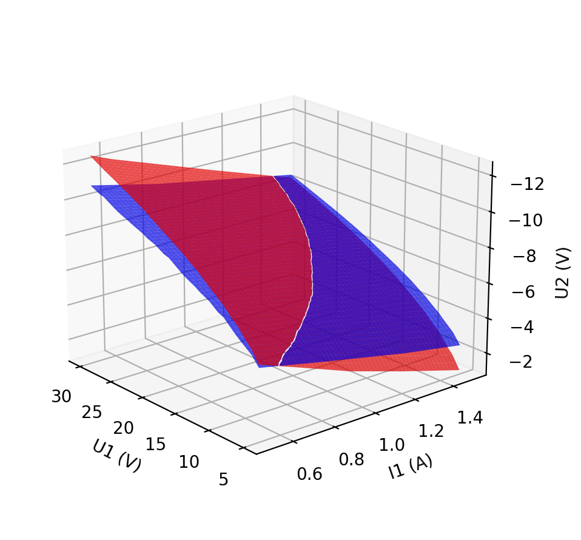

.. _curvematch:

.. include:: ../symbols.rst
.. |Dij| replace:: :math:`D_{ij}`
.. |D0| replace:: :math:`D_0`
.. |Ddelta| replace:: :math:`D_{ij}-D_0`

The |curvematch| program
==========================

.. autosummary::
   :toctree: generated

The |curvematch| program calculates the «difference between two curve sets». This is useful, for example, to find parts with similar curves (part matching). Consider the following figure where the |U1|, |I1|, and |U2| data from two different DUTs are represented by the red and blue surfaces:

The «difference between the two curve sets» is defined as the RMS value of the vertical difference between the two surfaces (i.e., the difference along the |U2| axis).

The procedure implemented in the |curvematch| program to calculate and report the difference between the curve sets is as follows:

   #. The values of the gate/grid voltage (|VG|) or base current (|IB|) of both DUTs are interpolated from the raw data to a rectangular grid of |U1| and |I1| values.
   #. The differences |Dij| of the |VG| or |IB| values are calculated at each grid point :math:`(i,j)`.
   #. The RMS value of the |Dij| values is reported. A low RMS value indicates a good overall match between the two DUTs (i.e., the surfaces in the 3-dimensional plot are almost identical).
   #. The mean |D0| of all |Dij| values is calculated, and the RMS value of |Ddelta| is reported. A low value indicates that the curves of the two DUTs tend to be parallel to each other, but may exhibit a constant |VG| or |IB| offset (i.e., the surfaces in the 3-dimensional plot are almost parallel, but may be offset vertically).

The calculation of these RMS values can be restricted to data within a certain range of |U1| and |I1| values.

The |curvematch| documentation can be accessed from the |curvematch| program directly:

.. code-block:: console

   curvematch --help
