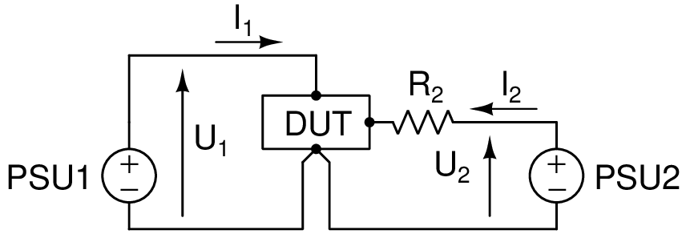

.. include:: ../symbols.rst

.. _curvetrace:

The |curvetrace| program
==========================

.. autosummary::
   :toctree: generated

.. _curvetrace_hardwaresetup:

The figure shows the circuit used to analyse a device under test (DUT). The |curvetrace| program controls the voltages |U1| and |U2| at the terminals of the programmable power supplies PSU1 and PSU2, and records the currents |I1| and |I2| using the built-in meters of PSU1 and PSU2. Both |U1| and |U2| are shwon as positive voltages in the figure. Negative voltages are achieved simply by connecting the terminals of the corresponding PSU(s) with inverted polarity.

The resistor |R2| serves multiple purposes:

   * For voltage-controlled DUTs like FETs or vacuum tubes, the resistor prevents high-frequency oscillation at the FET gate or tube grid. An |R2| value of approximately 10\ :sup:`3` |Ohm| is recommended, but the exact value is not critical and will not have an effect on the test results.
   * For current-controlled DUTs like BJTs, the resistor is used to convert the control voltage to the control current |IB|. The voltage drop across |R2| is equal to |U2| - |VBEon|, where |VBEon| is the base-emitter on voltage of the BJT. Therefore, the control current is given by Ohm's Law as |IB| = (|U2| - |VBEon|) / |R2|.

The |curvetrace| program allows limiting the currents (|I1|, |I2|) and power (|U1| × |I1|, |I2| × |U2|) to prevent overloading the DUT during testing.

The |curvetrace| program supports a number of different PSU models. See :ref:`supported_PSUs` for details.

The |curvetrace| program allows using a heater block to control the temperature of the DUT during curve tracing. See :ref:`heaterblock` for details.

Test procedure
--------------

The procedure implemented in the |curvetrace| program is as follows:

   1. Read the ``curvetrace_config.txt`` configuration file with the PSU details, and connect to the PSUs (see below).
   
   2. Interactively ask the user for a name or label of the test data, and then open an ASCII data file with that name (an existing file with the same name gets overwritten!).
   
   3. Determine the test conditions, either by interactively asking for user input, or by reading a DUT configuration file with the test parameters:
   
      * Start voltages, end voltages, and number of steps for each PSU
      * Max. allowed current and power applied from each PSU to the DUT
      * Polarity of how the PSU terminals are connected to the DUT terminals
      * Optional: number of readings at each voltage step (results will be averaged)
      * Optional: idle time and pre-heat time
      * If idle or pre-heat times are not zero: idle voltage and current conditions for the PSUs
      * Optional: DUT temperature
      
   4. Check the test configuration versus the limits of the PSUs, and adjust the configuration where needed.
   
   5. Show a summary of the test configuration and ask the user if it's okay to start the test.
   
   6. Run the test:
   
         * Optional (if a heater block is used): wait until the DUT has attained the specified temperature.
         * Optional: the DUT is conditioned for the test (this is especially useful for vacuum tubes). During a «pre-heat» period, |U1| is set to a predefined value, and and |U2| is automatically adjusted to attain a predefined |I1| value. The |U1|, |I1| and |U2| values at the end of the pre-heat are written to the data file.
         * The voltages are stepped in two nested loops. Voltage |U1| is varied in the inner loop, |U2| is varied in the outer loop. Optional: between readings, the DUT is re-conditioned during a (short) idle period in the same way as the pre-heat.
         * The measured data are shown on the screen and saved to the data file.
         
   7. Once the test is completed, turn off the PSUs.

.. _curvetrace_PSUconfig:

Power supply configuration
--------------------------
The basic configuration required for |curvetrace| to work is to specify the PSU models used, and their communication port is connected to the computer. To specify these configurations, create a file ``curvetrace_config.txt`` and enter the PSU configurations as follows:::

   [PSU1]
   TYPE    = ...
   COMPORT = ...

   [PSU2]
   TYPE    = ...
   COMPORT = ...

* ``TYPE``: the type or model of the PSU. See :ref:`supported_PSUs` for details.
* ``COMPORT``: path of the virtual file corresponding to the serial port of the PSU

See :ref:`examples_curvetrace` for examples of ``curvetrace_config.txt`` files.

Note that it is possible to connect multiple PSU units in series to each other to accomplish a higher voltage range. Such a series combination of multiple PSU units can be configured as a single PSU object by specifying their `TYPE` and `COMPORT` fields as follows:

* ``TYPE = ( "<type_psu1>" , "<type_psu2>" )``
* ``COMPORT = ( "<comport_psu1>" , "<comport_psu2>" )``

There are further configuration options to improve the the quality of the the PSU data (FULL DOCUMENTATION FOR THESE IS UNDER CONSTRUCTION):

* ``NUMSTABLEREAD``: number of readings that must have identical values in order to accept the reading.
* ``V_SET_CALPOLY``, ``I_SET_CALPOLY``, ``V_READ_CALPOLY`` and ``I_READ_CALPOLY``: coefficients to specify external calibration data to set and read the voltage and current values at the PSU.

Heater block configuration
--------------------------
The configuration of the heater block is only required if a heater block is used. The heater block configuration is also specified in the ``curvetrace_config.txt`` file. See :ref:`heaterblock` for details.

.. _curvetrace_DUTconfig:

DUT test configuration
----------------------
While it is possible to run ``pypsucurvetrace`` by manually entering all the test parameters, it is usually more convenient to use configuration files that contain all the DUT specific test parameters.

A test configuration file contains three sections ``[PSU1]``, ``[PSU2]``, and ``[EXTRA]`` (see also :ref:`examples`)::

   [PSU1]
   POLARITY    = ...
   VSTART      = ... 
   VEND        = ...
   VSTEP       = ...
   IMAX        = ...
   PMAX        = ...
   IIDLE       = ...
   VIDLE       = ...

   [PSU2]
   POLARITY    = ...
   VSTART      = ... 
   VEND        = ...
   VSTEP       = ...
   IMAX        = ...
   PMAX        = ...
   IIDLE       = ...
   VIDLE       = ...
   VIDLE_MIN   = ...
   VIDLE_MAX   = ...
   IDLE_GM     = ...

   [EXTRA]
   PREHEATSECS = ...
   IDLESECS    = ...
   NREP        = ...
   T_TARGET    = ...
   T_TOL       = ...
   
Parameters in the ``[PSU1]`` section:

* ``POLARITY`` is either 1 for normal polarity, or -1 for inverted polarity
* ``VSTART`` and ``VEND`` are the start and stop values of |U1|, and ``VSTEP`` is the |U1| increment size.
* ``IMAX`` and ``PMAX`` are the |I1| and |U1| × |I1| limits to prevent overloading the DUT.
* ``IIDLE`` and ``VIDLE`` are the |I1| and |U1| values for the pre-heat and idle periods.

The parameters in the ``[PSU2]`` section for PSU2 are analogous to the ``[PSU1]`` parameters. The ``[PSU2]`` section may contain the following additional parameters:

* ``VIDLE_MIN`` and ``VIDLE_MAX`` indicate the range of allowed idle voltages during pre-heat and idle periods.
* ``IDLE_GM`` is the transconductance value (in A/V) to be used for regulation of |I1| during pre-heat and idle by adjusting the |U2| voltage: ``IDLE_GM`` = |deltaI1| / |deltaU2| at the idle operating point.

Parameters in the ``[EXTRA]`` section:

* ``PREHEATSECS`` and ``IDLESECS`` are the length (seconds) of the pre-heat and idle periods.
* ``NREP`` is the number of repeated readings at each measurement step. Note that each reading is preceeded by an idle period if ``IDLECECS`` > 0.
* Optional: ``T_TARGET`` and ``T_TOL`` are the temperature target value and tolerance of the heater block (°C).

Running |curvetrace|
----------------------
The |curvetrace| program is invoked from the command line. Full documentation is not yet available in this document, but can be accessed from the |curvetrace| program directly:

.. code-block:: console

   curvetrace --help
