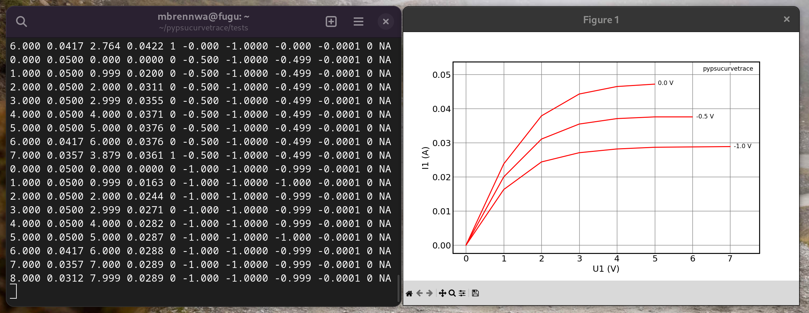
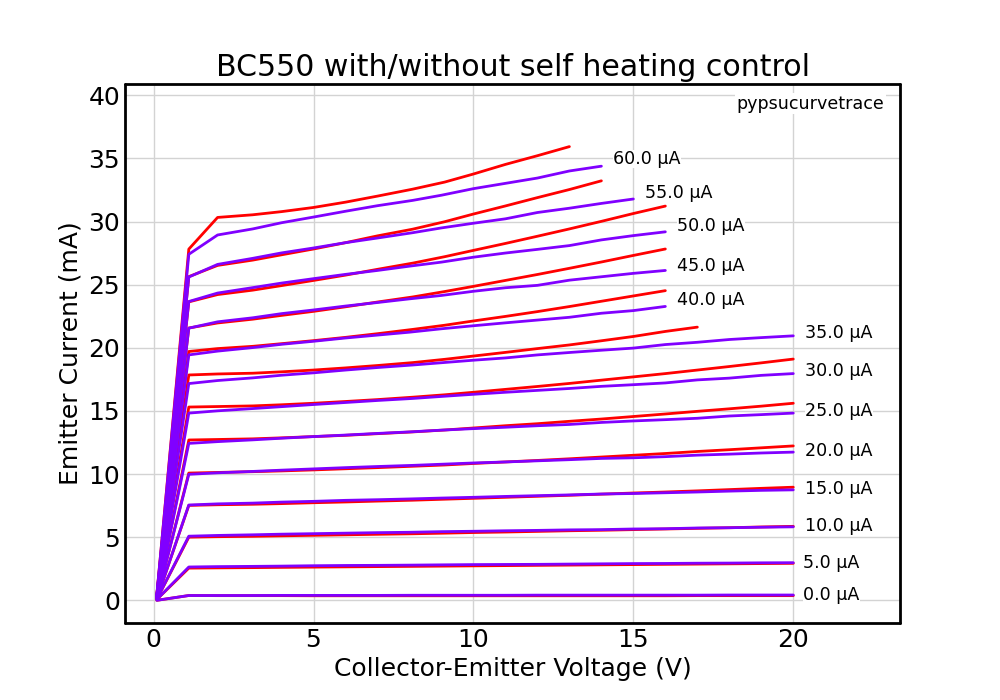
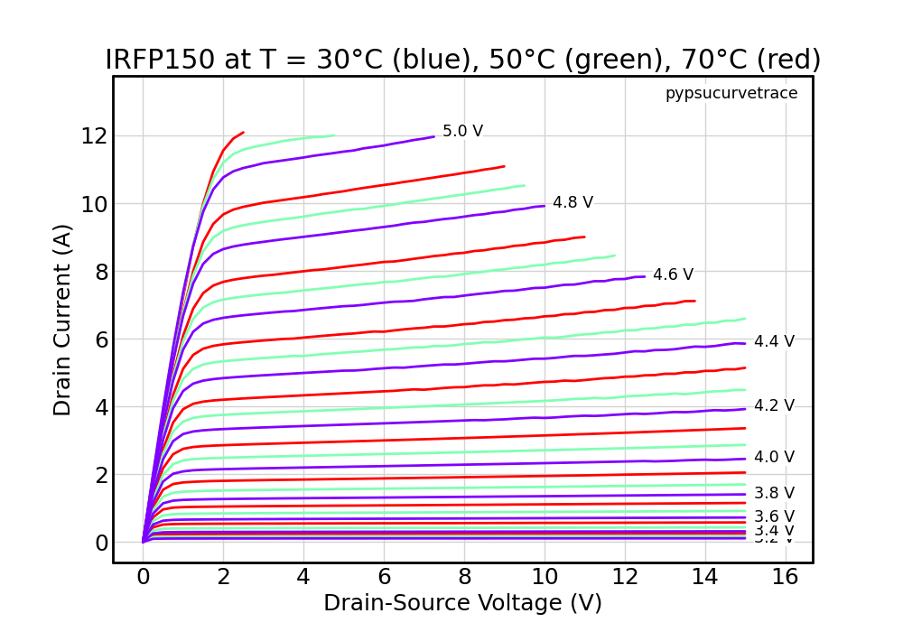
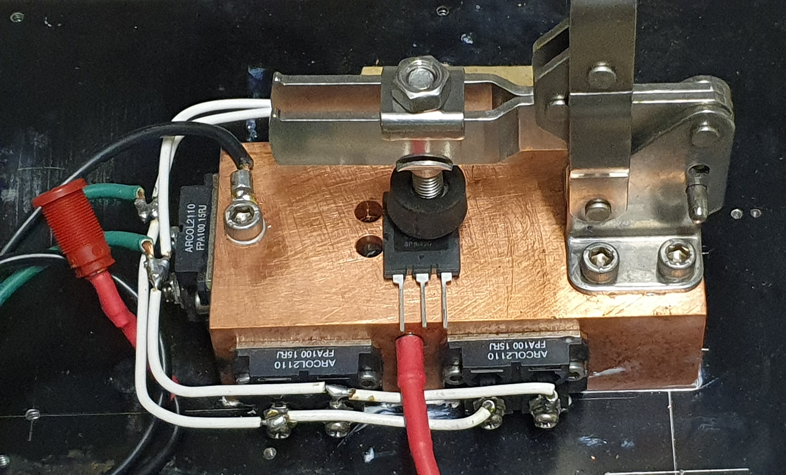

.. include:: ../symbols.rst

.. _examples:

Examples
========

.. autosummary::
   :toctree: generated

This chapter is a modular tutorial built around various examples illustrating the use of the |pypsucurvetrace| tools. It is assumed that you have the |pypsucurvetrace| software installed on your computer (see :ref:`installation` for details).

.. _examples_curvetrace:

Working with the |curvetrace| program
-------------------------------------

.. _examples_curvetrace_PSUconfig:

Configure the PSUs
^^^^^^^^^^^^^^^^^^
To use the |curvetrace| program, you need to setup the PSU configuration file (see :ref:`curvetrace_PSUconfig`). It is assumed that PSU1 unit is a Riden 6012P operating in it's 6 A / high-resolution mode, while PSU2 is a Riden 6006P (see :ref:`supported_PSUs`). These PSUs will be useful for testing a wide range of differen DUT types.

The simplest method to determine the ``COMPORT`` for PSU1 on Linux is to disconnect all serial interfaces except PSU1, and then list the virtual file representing the PSU1 serial port in the ``/dev/serial/by-path/`` directory. Repeat for PSU2.

To set up a minimal PSU configuration file that contains all information for the |curvetrace| program to establish the communication with PSU1 and PSU2, create a |PSU_configfile| file in your home directory and enter the following parameters (your ``COMPORT`` settings will be different):::

   [PSU1]
   TYPE    = RIDEN_6A
   COMPORT = /dev/serial/by-path/pci-0000:00:14.0-usb-0:2.4.3:1.0-port0

   [PSU2]
   TYPE    = RIDEN
   COMPORT = /dev/serial/by-path/pci-0000:00:14.0-usb-0:2.4.2:1.0-port0

If you have different PSUs for different curve-tracing needs, it may be convenient to keep the configurations of all PSU devices in the |PSU_configfile| file. Just make sure the active PSU1 and PSU2 devices are labelled ``[PSU1]`` and ``[PSU2]``, while the unused PSUs are labelled differently so they will be ignored by the |curvetrace| program. For example, if you would like to keep around the configurations for the Riden 6012P at 12 A / low-resolution mode and a BK Precision PSU, you could add them as ``disabled PSU1`` to the |PSU_configfile| file::

   [disabled PSU1]
   # Riden 6012P at 12A/high-res mode
   TYPE    = RIDEN_6A
   COMPORT = /dev/serial/by-path/pci-0000:00:14.0-usb-0:2.4.3:1.0-port0

   [disabled PSU1]
   # BK Precision
   TYPE    = BK
   COMPORT = /dev/serial/by-id/usb-Silicon_Labs_CP2102_USB_to_UART_Bridge_Controller_508D19126-if00-port0

   [PSU1]
   # Riden 6012P at 6A/high-res mode
   TYPE    = RIDEN_6A
   COMPORT = /dev/serial/by-path/pci-0000:00:14.0-usb-0:2.4.3:1.0-port0

   [PSU2]
   TYPE    = RIDEN
   COMPORT = /dev/serial/by-path/pci-0000:00:14.0-usb-0:2.4.2:1.0-port0

Testing a low-power N-channel FET
^^^^^^^^^^^^^^^^^^^^^^^^^^^^^^^^^
This first example uses the PSU configuration from above to demonstrate the curve tracing of a J112 N-channel jFET.

The J112 needs a positive Drain-Source voltage (|U1|) and a negative Gate-Source voltage (|U2|). Therefore, connect PSU1 with positive polarity and PSU2 with negative polarity to the J112 pins following the schematic in :ref:`curvetrace`:

   * PSU1-red to the Drain pin
   * PSU1-black to the Source pin and to PSU2-red
   * PSU2-red to PSU1-black
   * PSU2-black to a grid-stopper resistor at the Gate pin (approximately 1 k\ |Ohm|)
   
The test parameters for the J112 are defined by creating a ``J112_config.txt`` file containing the following parameters (see also :ref:`curvetrace_DUTconfig`)::

   [PSU1]
   POLARITY = 1
   VSTART = 0
   VEND   = 15
   VSTEP  = 1
   IMAX   = 0.05
   PMAX   = 0.25
   VIDLE  = 7.5
   IIDLE  = 0.02

   [PSU2]
   POLARITY = -1
   VSTART = 0.0
   VEND   = 3.5
   VSTEP  = 0.5
   IMAX   = 1
   PMAX   = 1
   VIDLE     = 5.0
   VIDLE_MIN = 0.0
   VIDLE_MAX = 5.0
   IDLE_GM   = -0.01
   IIDLE     = 1

   [EXTRA]
   IDLESECS    = 0
   PREHEATSECS = 20

Execute the following command to start the curve tracing:

.. code-block:: console

   curvetrace -config J112_config.txt
   
The |curvetrace| program starts communication with the PSUs, configures the test parameters, and asks you for a file name to save the DUT test data. Once everything is ready, the |curvetrace| program runst the pre-heat process by setting |U1| to the PSU1-``VIDLE`` value (7.5 v) and adjust |U2| until |I1| attains the PSU1-``IIDLE`` value of 0.02 A (20 mA). After 20 seconds the pre-heat is stopped (``PREHEATSECS``), and the curve tracing starts. |U2| is set to 0.0 V, and |U1| is stepped from 0-15 V in 1 V steps. This sequence is repeated for |U2| = -0.5 V, -1.0 V, ... , and -3.5 V. At each step, |U1|, |I1|, |U2|, and |I2| are measured and saved to the data file. The ``curvetrace`` program shows a live plot of the curve data during the measurement as shown below.

Testing a low-power NPN BJT
^^^^^^^^^^^^^^^^^^^^^^^^^^^

This example demonstrates how to test a bipolar transistor (BJT). In contrast to the previous example with the voltage-controlled FET, the BJT is controlled the base *current*. Since the base current is typically much smaller than the current measurement resolution of most PSUs, the ``curvetrace`` program uses the |R2| resistor to convert the |U2| voltage to the base current value (see ref:`curvetrace` for details). The conversion relies on the |R2| value, which must be determined considering the max. |U2| output voltage of the PSU2 and the max. |IB| current required for the test. The max. output voltage of PSU2 (Riden 6006P) is 60 V, and the targeted base current should range up to about 50 μA. With |IB| = (|U2| - |VBEon|) / |R2|, a suitable value for the test setup is |R2| = 100 k\ |Ohm|.

The BC550 needs a positive Collector-Emitter voltage (|U1|) and a positive Base-Emitter voltage (|U2|), so you need to connect the pins as follows:

   * PSU1-red to the Collector pin
   * PSU1-black to the Emitter pin and to PSU2-black
   * PSU2-red to the Base pin via the 100 k\ |Ohm| |R2| resistor
   * PSU2-black to PSU2-black
   
The test parameters for the BC550 are defined in the same way as in the previous example by creating a file ``BC550_config.txt`` with the following parameters::

   [PSU1]
   POLARITY = 1
   VSTART = 0
   VEND   = 20
   VSTEP  = 1
   IMAX   = 0.1
   PMAX   = 0.5
   VIDLE  = 5
   IIDLE  = 0.02
   
   [PSU2]
   POLARITY = 1
   VSTART = 0.65
   VEND   = 6.65
   VSTEP  = 0.5
   IMAX   = 0.1
   PMAX   = 1
   VIDLE     = 0.8
   VIDLE_MIN = 0.0
   VIDLE_MAX = 20
   IDLE_GM   = 0.01
   IIDLE     = 1
   
   [EXTRA]
   R2CONTROL = 100000
   IDLESECS    = 2
   PREHEATSECS = 60

Run |curvetrace|:

.. code-block:: console

   curvetrace -config BC550_config.txt

The curve tracing works in the same way as in the previous example, with two notable differences:
   * The |U2| steps start at 0.65 V, which is the (assumed) |VBEon| value of the BC550. The conversion from |U2| to the base-current will done later during curve plotting and data processing (see also :ref:`examples_curveplot`, :ref:`examples_curveprocess` and :ref:`examples_curvematch`).
   * There is a 2 second idle time between each reading for thermal re-equilibration of the BC550 before each reading. This reduces the thermal runaway at higher power levels due to self-heating of the transistor. The following plot compares the BC550 curves measured with and without the idle time between readings:

Using a heater block to test a power transistor at controlled temperature
^^^^^^^^^^^^^^^^^^^^^^^^^^^^^^^^^^^^^^^^^^^^^^^^^^^^^^^^^^^^^^^^^^^^^^^^^

Power transistors can produce a lot more heat than the low-power components considered in the previous examples. To avoid thermal runaway and distortion of the curves at high power levels, the DUT temperature must remain stable during curve tracing. In principle, this could be achieved in the same way as in the BC550 example, where the DUT was operated at a fixed power level to attain thermal equilibrium during idle periods before each measurement. However, at higher power levels, the required idle periods can become excessively long, and self-heating during a single measurement may become significant. The «idle period» method therefore does not work well for testing transistors at high power levels.

A more efficient method to control the DUT temperature is to clamp it to a large block of metal with a regulated heater element. The thermal inertia of the metal block greatly reduces short-term fluctuations of the DUT temperature. The heater allows controlling the temperature of the metal block and the DUT to a predefined value. See :ref:`heaterblock` and :ref:`examples_curvetrace_heaterblock` for more details.

To use the temperature control of the heater block, add the following parameters to the ``[EXTRA]`` section of your DUT test config file::

   [EXTRA]
   ...
   T_TARGET = 50
   T_TOL    = 0.5

The below figure shows the curves from an IRFP150 power FET, which was clamped on a heater block. The curves were measured at 30°C, 50°C and 70°C. The curves do not show any thermal runaway, because the temperature was always stable to within 0.5°C of the nominal value.

Testing a vacuum tube
^^^^^^^^^^^^^^^^^^^^^

Analysing a vacuum tube works in the same way as with semiconductors. The obvious differences are (i) that vacuum tubes require an additional power supply with a fixed output for the heater filament(s) and (ii) that tubes tend to work at higher voltages.

This example assumes a 807 beam power tube configured for triode operation. Connect the filament pins to a 6.3 V / 0.9 A power supply, and Grid-2 to the Anode via a grid stopper resistor (for triode operation).

The anode voltage is controlled by a BK Precision 8158B as PSU1, while the Grid-1 voltage is controlled by the same Riden 6006P as in the previous examples (see :ref:`examples_curvetrace_PSUconfig` for a convenient method to switch between PSU units for different applications).

The tube needs a positive Anode-Cathode voltage (|U1|) and a negative Grid-Cathde voltage (|U2|), so you need to connect the pins as follows:

   * PSU1-red to the Anode pin
   * PSU1-black to the Cathode pin and to PSU2-red
   * PSU2-red to PSU2-black
   * PSU2-black to the Grid-1 pin (via a grid stopper resistor)   
   
The test parameters for the 807 tube are defined in a ``807_triode_config.txt`` file, which might look like this::

   [PSU1]
   POLARITY = 1
   VSTART = 0
   VEND   = 400
   VSTEP  = 5
   IMAX   = 0.125
   PMAX   = 50
   VIDLE  = 300
   IIDLE  = 0.075
   
   [PSU2]
   POLARITY = -1
   VSTART = 0.0
   VEND   = 60
   VSTEP  = 5
   IMAX   = 1
   PMAX   = 5
   VIDLE     = 25.0
   VIDLE_MIN = 0.0
   VIDLE_MAX = 60.0
   IDLE_GM   = -0.007
   IIDLE     = 1
   
   [EXTRA]
   IDLESECS    = 0
   PREHEATSECS = 300

Note the somewhat long pre-heat time (``PREHEATSECS=300``), which makes sure the tube has warmed up and stabilized before the curve tracing starts. Also, make sure to not skip the grid stopper resistors at Grid-1 and Grid-2 to prevent oscillation. With this test setup, the curves recorded with the |curvetrace| program will look like in the figure below.

.. _examples_curvetrace_batchmode:

Batch mode
^^^^^^^^^^

When testing multiple DUTs of the same type, it may be useful to use the ``--batch`` mode of the |curvetrace| program. In this mode, the |curvetrace| program will automatically enumerate the file names and sample labels. Also, if a heater block is used, it will keept the temperature control active between test runs to avoid the down time related to temperature stabilization. To run a batch of 2SK82 VFETs, you would run |curvetrace| with the ``--batch`` flag as follows:

.. code-block:: console

   curvetrace --config 2SK82_config.txt --batch
   
The |curvetrace| program will ask for the base name to use for the file names and sample labels before running the test procedures for each DUT. Once it's done with testing the first DUT, it will tell you to install the second DUT before it continues with the testing.

.. _examples_curvetrace_heaterblock:

Construction of a heater block for DUT temperature control
^^^^^^^^^^^^^^^^^^^^^^^^^^^^^^^^^^^^^^^^^^^^^^^^^^^^^^^^^^
This example illustrates the design and construction of a heater block for temperature control of the DUT during curve tracing (see also :ref:`heaterblock`).

Here's a photo of the heater block:

The heater block in this example is powered by a Voltcraft PPS-16005 PSU (36 V / 12 A max. output).

The following parts were used to build the heater block:
   * A copper block with a weight of approximately 2.8 kg (13 cm × 6 cm × 4 cm). Copper has a specific heat of 0.385 kJ/kg/K, so the heat capacity of the copper block is approximately H = 1 kJ/K.
   * Five 100 W power resistors (Arcol FPA100). The resistors were bolted to the sides of the copper block. To fully exploit the power provided by the PSU (up to 36 V / 12 A / 430 W), the resistance of the resistor array should be 36 V / 12 A = 3 Ω. With the resistors connected in parallel, the resistance of the single resistors is 5 × 3 Ω = 15 Ω.
   * A DS18B20 temperature sensor with a metal sleeve housing was inserted and glued into a bore to measure the temperature of the copper block just underneath the DUT. An FTDI TTL-232R-RPI cable was used to interface the 1-Wire bus of the DS18B20 sensor chip to the USB port of the computer (COM port = ``/dev/serial/by-id/usb-FTDI_TTL232R-3V3_FTBZLSUL-if00-port0``).
   * An adjustable toggle lever clamp was mounted on the top of the copper block to allow easy clamping of the DUT to the copper block.
   * The copper block was bolted to a large heatsink to allow efficient dissipation of any excess heat. The heatsink improves the cooling the heater block and therefore helps with the regulation of the heater block temperature.

The time required to heat the copper block to a predefined temperature depends on the heating power P (430 W), the heat capacity H of the copper block (1 kJ/K), and the temperature change ΔT. For example, heating the block from 20°C to 50°C (ΔT = 30 K) will take at least H×ΔT/P = 70 seconds. In practice the heating time will be longer, because the PID controller needs to reduce the power before reaching the target temperature to avoid overshoot of the temperature. The coefficients of the PID controller were estimated as described `here <https://en.wikipedia.org/wiki/PID_controller#Manual_tuning>`_ by repeated trial-and-error runs of the |curvetrace| program with different PID coefficient values in the |PSU_configfile| file.

The ``[HEATERBLOCK]`` section in the |PSU_configfile| file looks like this::

   [HEATERBLOCK]

   PSU_COMPORT       = /dev/serial/by-id/usb-Silicon_Labs_CP2102_USB_to_UART_Bridge_Controller_0010-if00-port0
   PSU_TYPE          = VOLTCRAFT
   TEMPSENS_COMPORT  = /dev/serial/by-id/usb-FTDI_TTL232R-3V3_FTBZLSUL-if00-port0
   TEMPSENS_TYPE     = DS1820
   TBUFFER_NUM       = 5
   TBUFFER_INTERVAL  = 1
   HEATER_RESISTANCE = 3
   MAX_POWER         = 430
   KP                = 100
   KI                = 1.3
   KD                = 100
   
   
.. _examples_curveplot:

Working with the |curveplot| program
------------------------------------

The first example uses the curves measured in the above |curvetrace| example for the 807 tube. The |curveplot| program produces a simple plot of the 807 curves from the data file with the name ``807curves.dat``:

.. code-block:: console

   curveplot 807curves.dat
   
This will plot the curves on the screen as shown in the above figure, except that the title and axis labels may benefit from some tweaking. For example:

.. code-block:: console

   curveplot 807curves.dat --title "807 Tube (triode connected)" --xlabel "Anode-Cathod Voltage" --ylabel "Anode Current"

Note how the units on the axes are automatically determined and added by the |curveplot| program.

To save the figure to a PDF file:

.. code-block:: console

   curveplot 807curves.dat --title "807 Tube (triode connected)" --xlabel "Anode-Cathod Voltage" --ylabel "Anode Current" --savepdf

The |curveplot| program produces a simple plot of the 807 curves from the data file with the name ``807curves.dat``:

The second example uses the curves measured in the above |curvetrace| example for the BC550 BJT. The BJT data file (``BC550.dat``) contains the value of the |R2| resistor used to control the |IB| values. If the |VBEon| value is specified to the |curveplot| program, it will automatically convert the |U2| data to the |IB| values applied to the BJT base and use these values as labels for the BJT curves as shown in the above BJT example

.. code-block:: console

   curveplot BC550.dat --bjtvbe 0.65
   

.. _examples_curveprocess:

Working with the |curveprocess| program
---------------------------------------

To determine the characteristic parameters from the curve data measured from a 300B tube at 300 V and 60 mA:

.. code-block:: console

   curveprocess --U1I1 [300,0.06] 300B_1.dat

The program will output the results in comma-separated tabular form:

.. code-block:: console

   Filename, Sample, U1 (V), I1 (A), Ug (V), gm (A/V), go (A/V), μ (V/V), T (°C)
   300B_1, 300B_TJMesh_1, 300, 0.06, -60.85, 0.004226, 0.000802, 5.269, NA
   
   
To process a batch of data files from multiple DUTs and save the resuls in a comma-separated ASCII table:

.. code-block:: console

   curveprocess --U1I1 [300,0.06] --nohello 300B_*.dat > 300B_parameters.csv

.. _examples_curvematch:

Working with the |curvematch| program
-------------------------------------

UNDER CONSTRUCTION

.. _examples_curveconvert:

Working with the |curveconvert| program
-------------------------------------

Convert an `Essues eTracer <https://www.essues.com/etracer>`_ CSV data file (``ECC81_et.csv``) to a |pypsucurvetrace| data file (``ECC81_pypsu.dat``):

.. code-block:: console

   curveconvert ECC81_et.csv --etracer > ECC81_pypsu.dat

