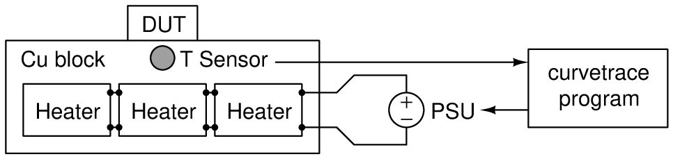

.. _heaterblock:

.. include:: ../symbols.rst

************
Heater Block
************

The |curvetrace| program allows controlling the temperature of the DUT during curve tracing. To this end, the DUT is clamped onto a large metal block equipped with heater elements and a temperature sensor. The heater block temperature is controlled by the |curvetrace| program by reading the temperature sensor and adjusting the power of the heater element, as illustrated in the following diagram:

* The thermal inertia of the metal block should be much larger than that of the DUT to allow tight control of the DUT temperature by the heater block. A large block of copper is recommended, which exhibits a large specific heat capacity and thermal conductance.
* Power resistors are used as heater elements. The resistor array is powered by a PSU, which is controlled by the |curvetrace| program (see :ref:`supported_PSUs` for supported PSUs). The heating power from the resistors and PSU should match the heat capacity of the heater block
* A Maxim DS18B20 digital temperature sensor is used to read the heater block temperature. The 1-Wire bus of the DS18B20 is connected to the computer using a USB-TTL cable (for example FTDI TTL-232R-RPI).
* The temperature control loop is implemented as a software `PID controller <https://en.wikipedia.org/wiki/PID_controller>`_ in the |curvetrace| program.

See :ref:`examples_curvetrace_heaterblock` for an example of such a heater block.

The configuration of the heaterblock for the |curvetrace| program is specified in the |PSU_configfile| by adding a ``[HEATERBLOCK]`` section as follows:::

   [HEATERBLOCK]

   PSU_COMPORT       = ...
   PSU_TYPE          = ...

   TEMPSENS_COMPORT  = ...
   TEMPSENS_TYPE     = ...

   TBUFFER_NUM       = 5
   TBUFFER_INTERVAL  = 1
   NUMSTABLEREAD     = 5

   HEATER_RESISTANCE = ...
   MAX_POWER         = ...

   KP                = ...
   KI                = ...
   KD                = ...

UNDER CONSTRUCTION / TO DO:
* EXPLAIN CONFIG PARAMETERS (SEE OLD TEMPLATE FILE)
* GET NICER PHOTO AND USE THIS IN THE CONSTRUCTION EXAMPLE (NOT HERE)

.. image:: heaterblock_photo.jpg
  :width: 658
  :alt: Heater block photo
